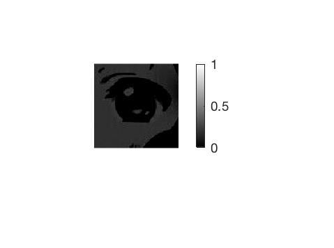
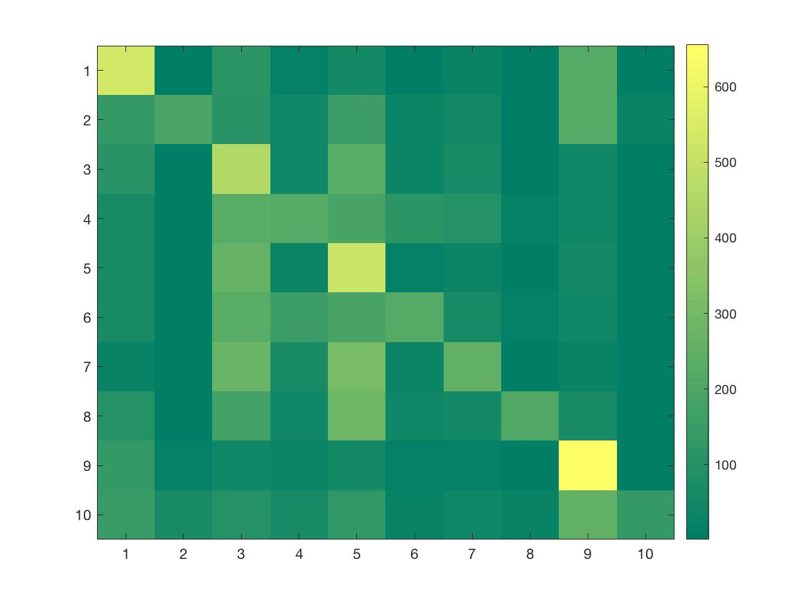

## HW1 by Yuan Tao
### A: Matlab Warmup
#### 1
a). x is a row vector which contains a random permutation of the integers from 1 to 5.

b). a is a 3-by-3 matrix.  
b is a row vector which is the entire second row of matrix a. [4 5 6]

c). f is a row vector which contains the integers from 1501 to 2000.  
g is a row vector which contains the index of numbers that are bigger than 1850 in f. [351:500]  
h is a row vector which is the sub-vector of f that bigger than 1850. [1851:2000]

d). x is an 1-by-10 array of 22.
y is the sum of all the elements in x, which is 22x1x10. 220

e). a is a row vector which contains the integers from 1 to 100.  
b is a row vector which is the sub-vector of a that index from the end to 1 with step -1. [100:-1:1] => [100 99 98 ... 1]

#### 2
My avatar:

The subregion in gray:

**2a** The intensities plot:

**2b** The histogram:

**2c** The binary image:(I set the threshold as 0.7)

**2d** The bottom right quadrant:

**2e** The darker image:

**2f** The mirror-flipped image:

**2g** The result:

**2h** The result:

### B: Computing average images
#### The 6 image:
Set1 in the left and Set2 in the right,

The results from step2 and step3 look different because step3 randomly flip the image. So the average computed result from step3 would be somehow more symmetrical than step2 assuming all the figures in one data set have some similarities.

### C: Image classification
#### 1
The first airplane:

#### 2
I randomly picked the 7th image in the test dataset to predict. Using my written KNN function and set the k equals to 1, it predicted the image as class 6 while it's label is class 1.
#### 3
Well, for the k = 1, we can see:

>Classification\_rate: 0.3539
Misclassification\_rate: 0.6461

#### 4
For k = 1, it's in last question.
For k = 3,

>Classification\_rate: 0.3303
Misclassification\_rate: 0.6697

For k = 5,

>Classification\_rate: 0.3398
Misclassification\_rate: 0.6602

#### 5
##### Using cosine

And we could see the best result happens when k=1, which is quite weird... As we could realize it, the result highly depends on how the most common label is computed when k is small. 

And the corresponding class confusion matrix is:

>Classification\_rate: 0.3672
Misclassification\_rate: 0.6328

##### Using correlation

We see that the best result comes when k=14, with:
>Classification\_rate: 0.4459
Misclassification\_rate: 0.5541

And the class-confusion matrix is:

#### 6
Well, if only considering what we have so far, the best performance come from `K=14,'correlation'`, where the accuracy is 44.59%. Since the classification rate is the highest and the distance function itself shows more stability than the other distance functions. And the size of K is proper where too small K makes it not stable, too big K makes the performance start to going down.  
And the pair of classes that tend to get confused with each other are:
(1,9) (2,10) (3,5) and (4,6), which correspond to:
(airplane,ship), (automobile,truck), (bird,deer) and (cat,dog) which make sense.  
Some examples of cats that mis-classified as dogs:

Well, it's hard to tell. Usually cats and dogs have similar size and color. Also the figure is so low-quality which may lead to these cats closed to some of the dog's figures.

#### 7
Given the fact that usually the important information is in the mid of the figure, I was thinking about given the pixels in the middle more weight. I simply implemented it by only consider the mid 20-by-20 matrix with rgb color. Well, it's not that good. But I think it might help if you adjust the parameter a little bit.

And the best performance:
>Classification\_rate: 0.4175
Misclassification\_rate: 0.5825

