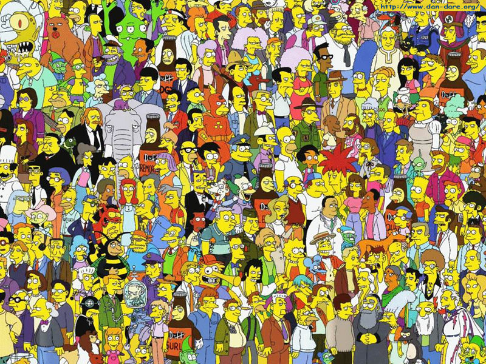
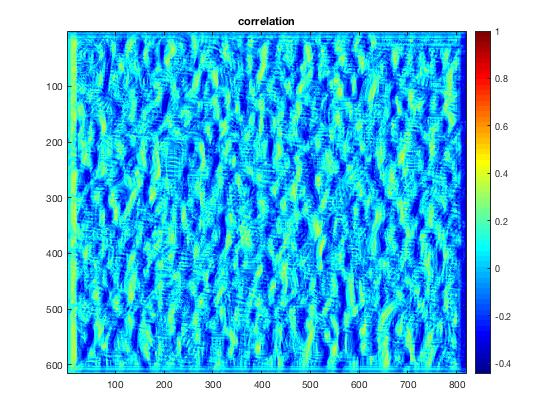
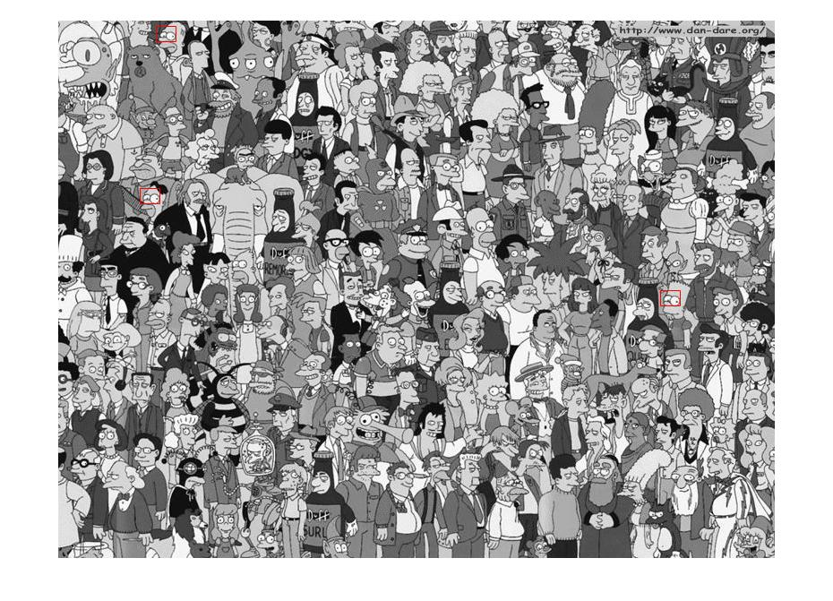

## HW2 by Yuan Tao
#### 1 Prove that convolution is associative, that is that$(f\star g)\star h = f\star(g\star h)$. And show by example that correlation is not associative. (only 1D needed)
Proof:
$$Convolution:  ~~~~~~(f\star g)(x)=\sum_{k=-\infty}^\infty f(k)g(x-k)$$

$$((f\star g)\star h)(x)=\sum_{k=-\infty}^\infty(f\star g)(k)h(x-k)$$
$$=\sum_{k=-\infty}^\infty\sum_{l=-\infty}^\infty f(l)g(k-l)h(x-k)$$
$$=\sum_{l=-\infty}^\infty\sum_{k=-\infty}^\infty f(l)g(k-l)h((x-l)-(k-l))$$
$$=\sum_{l=-\infty}^\infty\sum_{k=-\infty}^\infty f(l)g(k)h((x-l)-k)$$
$$=\sum_{l=-\infty}^\infty f(l)(g\star h)(x-l)$$
$$=(f\star(g\star h))(x)$$
So, convolution is associative.
Since the question only wants an example to show:
We choose f=(1 2 3), g=(1 2 3), h=(3 2 1)as an example
$$((f\star g)\star h)(x)=(1~2~3)\star(1~2~3)\star(3~2~1)$$
$$=(3~8~14~8~3)\star(3~2~1)$$
$$=(9~30~61~60~39~14~3)$$
$$(f\star (g\star h))(x)=(1~2~3)\star((1~2~3)\star(3~2~1))$$
$$=(1~2~3)\star(9~12~10~4~1)$$
$$=(27~54~69~44~21~6~1)$$
Since the two answers don't match, correlation is not associative.


#### 2 If we have an image I of dimension $H\times W$ and we convolve it with a filter $f$ of size $M\times N$ using the spatial domain formula given in class, what will the complexity be (i.e. how many multiplications)? How about if we use the FFT "trick"?
For each pixel in the HxW image, we need to convolve an MxN size filter which normally has MxN multiplications. So the complexity is $O(MNHW)$.
And if we use the FFT trick, the convolution $I\star f=F^{-1}(F(I)\star F(m))$ which would cost $O(MNlog(MN))$(assuming MN>HW)

<div STYLE="page-break-after: always;"></div>

#### 3 Starting with the formula for 2D convolution, show that if our filter is the product of two functions, $f(x, y) = f_1(x)f_2(y)$, we can compute the convolution more efficiently. Is there a way to use this idea to speed up convlution with a 2D isotropic Gaussian filter $g(x, y) =\frac1{2\pi\sigma^2}exp^{-\frac{(x^2+y^2)}{2\sigma^2}}$
The formula for 2D convolution is:
$$(I\star f)(m,n)=\sum_{k=-\infty}^\infty\sum_{l=-\infty}^\infty I(m-k,n-l)f(k,l)$$
If $f(x, y) = f_1(x)f_2(y)$,
$$(I\star f)(m,n)=\sum_{k=-\infty}^\infty\sum_{l=-\infty}^\infty I(m-k,n-l)f_1(k)f_2(l)$$
$$=\sum_{k=-\infty}^\infty f_1(k)(I\star f_2)(m-k,n)$$
Thus the 2D convolution is actually deposed into two 1D convolutions, which we could more efficiently compute.

And for the 2D isotropic Gaussian filter, since it could be separated as following:
$$g(x, y) =\frac1{2\pi\sigma^2}exp^{-\frac{(x^2+y^2)}{2\sigma^2}}=\frac1{\sqrt{2\pi}\sigma}exp^{-\frac{x^2}{2\sigma^2}}*\frac1{\sqrt{2\pi}\sigma}exp^{-\frac{y^2}{2\sigma^2}}=g_1(x)*g_2(y)$$
And we could compute it by first computing the g1(x) on the columns and then g2(y) on the rows.

<div STYLE="page-break-after: always;"></div>

#### 4 Experiment with the discrete Fourier transform (DFT) in MATLAB.
##### a) Start out in 1D and make a signal which is of length 100 with a single impulse of height 1 in the middle. Compute the DFT of the signal and plot the magnitude of the spectrum.

##### b) Now increase the width of the pulse from a single sample to a unit height "box function" 5 and 10 samples long and plot resulting the spectrum magnitudes.


<div STYLE="page-break-after: always;"></div>

##### c) Now do the same for a Gaussian function with $\sigma$ = 1 and $\sigma$ = 2 (the Gaussian has infinite support but you should just analyze a finite chunk centered around the origin).


<div STYLE="page-break-after: always;"></div>

##### d) Lastly, figure out how to do a 2D DFT and inverse DFT. Replicate the experiment we showed in class (shown as Figure 7.6 in Forsyth and Ponce) of swapping phase and magnitude by (1) computing the DFT of two images of the same size, (2) computing a new set of coefficents which have the phase from the first image and the mangitude from the second image, (3) taking the inverse DFT of this combined spectrum to produce a new image.
The two zebra image that I chose for this experiment.


<div STYLE="page-break-after: always;"></div>

The phase for zebra1,


<div STYLE="page-break-after: always;"></div>

The magnitude for zebra2,


<div STYLE="page-break-after: always;"></div>

The new zebra!

##### e)


Here I chose the special function $y=sin(x)+0.2*x$. And the result looks quite interesting.

<div STYLE="page-break-after: always;"></div>

#### 5 Write a gradient based edge detector in MATLAB. Your code should load in a grayscale image (use `imread` and convert to a double array using `im2double`). You can display the image using imagesc and colormap gray. Once you have loaded in the image, you should smooth the image with a Gaussian filter and then compute horizontal and vertical derivatives using the derivative filter described in lecture. The amount of smoothing is determined by the $\sigma$ of the Gaussian(which should be a parameter of your code). You can use `conv2` with the 'same' option to perform the required convolutions. Once you have computed the derivatives in the x and y directions using convolution, compute the gradient magnitude and orientation.
for $\sigma = 0.03$


for $\sigma = 1$


for $\sigma = 2$


As we could see, the bigger sigma is, the thicker edge I get.

<div STYLE="page-break-after: always;"></div>

#### 6 Implement a simple object detector based on correlation. Load in one of the test images provided and display it on the screen. Clip out a patch of the image containing an object you want to detect (you may find `ginput` useful to get pixel coordinates for user clicks). Use this patch as a template in order to try and detect other instances of the object in the image by correlation. Visualize the result of the cross-correlation as an image using the `imagesc` command and `colormap jet`. Initially experiment with choosing a relatively small "object" such as Dilbert's nose or a single letter. You can try thresholding the result of correlation but you will note that around detected objects there will be many pixels with high values. In order to suppress non-maximal locations, zero out any scores which are smaller than one of their 8 neighbors. You can do this easily in MATLAB using array indexing, e.g. in 1D this would look like:

```
L = (x(2:end-1) > x(1:end-2)) % bigger than our neighbor to the left?
R = (x(2:end-1) > x(3:end)) % bigger than our neighbor to the right?
T = x(2:end-1) > threshold %above detection threshold?
maxima = R & L & T
```


I chose the simpsons figure for Problem 6 and 7, and changed it to gray for easier detection.

I chose simpson's eye as the template.


The threshold for this is 0.5. And it detected 3 similar pairs of eyes. It works pretty well.

<div STYLE="page-break-after: always;"></div>

#### 7 Modify your code from the previous experiment to compute the sum of squared differences (SSD) of pixel values. If before you had the simple inner product computation:
```
response = conv2(I,T);
```
#### instead try out the squared difference between template T and the image I:

```
IT = conv2(I,T);
Tsquared = sum(sum(T.^2));
Isquared = conv2(I.^2,ones(size(T)));
squareddiff = (Isquared - 2*IT + Tsquared);
```


I chose the threshold -13.

For the eyes detection, I see that the SSD works much worse than the normalized cross-correlation one. And it detected a lot of weird results. But SSD has a faster speed. 

