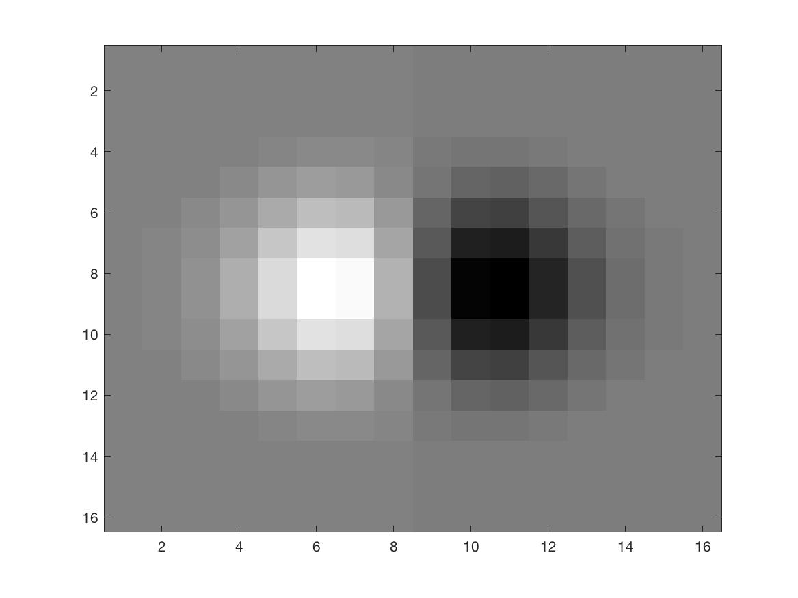
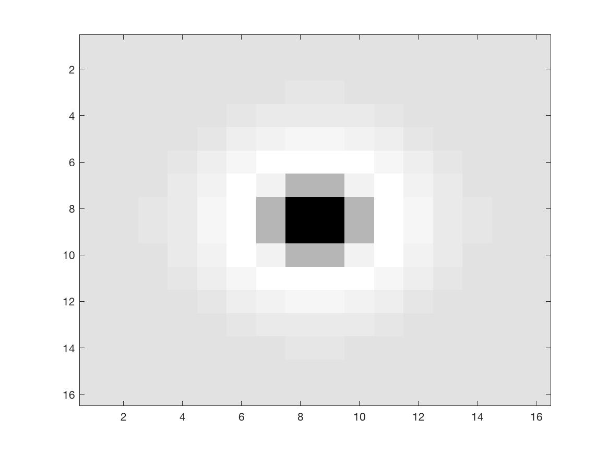
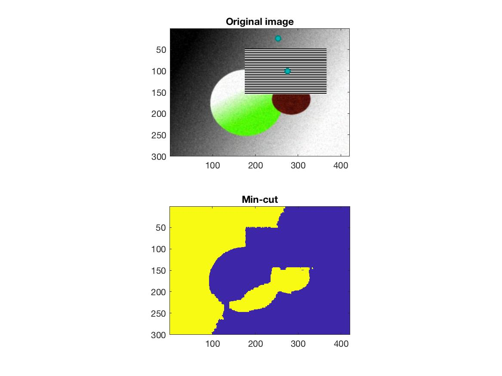

## HW3 by Yuan Tao
#### 1 Color quantization
The figure that I use for this question:

The clustering with k = 2:

The clustering with k = 5:

The clustering with k = 10:

If I scale one of the feature coordinates,
red by factor of 1000:

by factor of 0.001:

We can see from the two different scale, that by giving red a different weight during clustering, the result will differ. So it's very important to do data normalization.

#### 2 Filterbank
I use the zebra\_small image,

And the filter kernels are:
h\_1

h\_2

h\_4

v\_1

v\_2

v\_4

G2-G1

G4-G2

The filter response images are:
h\_1

h\_2

h\_4

v\_1

v\_2

v\_4

G2-G1

G4-G2

#### 3 Filter Distribution
The 3 different patches:
Neck:     Tree:  Grass: 
The distrubution is:

We can see that the distribution is quite different according to different feature.
In the neck patch, the horizontal mean features are very high because the zebra's pattern in the neck are mostly verticle stripes.
In the tree patch, the pattern is kind of vague, so the 8 features are are very average.

Well, I didn't rescale the figure at all, since I picked good patches. I think the rescale would help us to get the representative patches more easily.

#### 4 MRF Segmentation
##### a
On testImage1:

There are 3 objects on the background in this figure. I tested it with different objects.

On testImage2:

On my image:
I choose clothes and hair and the background as different elements.

##### b 
I add the texture feature to the original function:
The texton looks like this:
the final result:
The texton of the zebra stripe:

The texton of black:

The texton of hair:

This image is actually hard to segment, since the texture are very alike.

A good lambda here can make the result very good. We can see that by adding more features, the result is getting better.

The successes are mostly from those figures with good features that can be easily distinguished from the background. Also what seed to choose is very important. The failures are for similar reasons. I didn't do anything to process the edges, which is another reason.

Actually I think the physical distance are important too and would help in my figure.
#### 5 Project Proposal
I am interested in one of the project in the online competition platform Kaggle, which is called "CVPR 2018 WAD Video Segmentation Challenge". The goal is to segment each objects within image frames captured by vehicles. It is important to quickly tell the difference between a person vs. a stop sign for autonomous vehicles so that they can drive in a much safer way.
